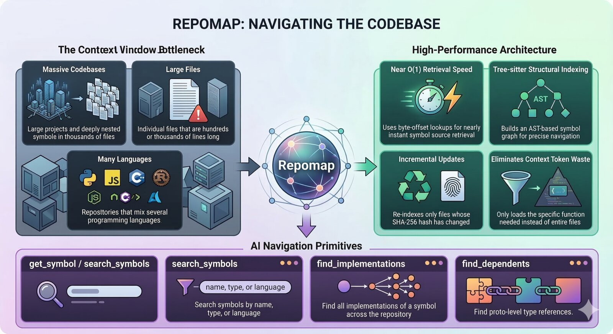
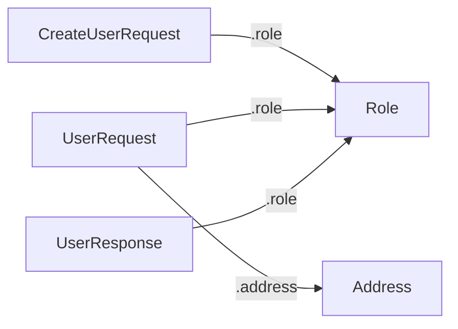

# repomap



An MCP server that gives AI assistants surgical access to large codebases.
It only returns the symbols and their sources, not entire files.

---

## Why it exists

When an AI assistant needs to understand a function buried inside a 600-line
file, it has two choices: load the whole file (burning context tokens on code
it doesn't need), or have a smarter interface that can answer "show me just
this function."

This server provides that interface.  It parses source files with
[tree-sitter](https://tree-sitter.github.io/tree-sitter/) into a per-repo
SQLite symbol index, then exposes MCP tools that let Claude navigate
codebases at the symbol level:

- Browse the file tree
- Get a file's outline (all classes, functions, and methods with signatures)
- Search symbols by name, kind, or language
- Fetch the exact source of one symbol by ID
- Search raw file text when symbol search isn't enough
- Query cross-file relationships (proto field references, parent/child nesting)
- Track token savings vs loading full files

---

## Supported languages

Python · TypeScript · JavaScript · Go · Rust · Java · PHP · Dart · C# · C · Lua · SQL · Protocol Buffers

---

## Installation

### Quick install

```sh
curl -fsSL https://raw.githubusercontent.com/christophergutierrez/repomap/main/install.sh | sh
```

### Homebrew

```sh
brew install christophergutierrez/repomap/repomap
```

### Cargo

```sh
cargo install --git https://github.com/christophergutierrez/repomap
```

### Build from source

```bash
cargo build --release
cargo install --path .
```

---

## Setup

### 1. Configure Claude Code

```sh
claude mcp add --transport stdio repomap "$(which repomap)"
```

Start a new Claude Code session after adding.  The MCP tools appear automatically.

### 2. Initialize a repo

```sh
cd /path/to/your/repo
repomap init
```

This indexes the repo and installs git hooks (`post-merge`, `post-checkout`)
that automatically re-index when you pull or switch branches. One command, fully set up.

The index persists on disk (`~/.code-index/`) and survives across sessions.

To remove the hooks later: `repomap deinit`

### 3. Optional: AI-enhanced summaries (CLI only)

When indexing from the command line, repomap can call an AI to generate
one-line summaries for each symbol. This is optional — everything works
without it, and indexing via MCP (from inside Claude Code) skips AI
summaries by default since the AI assistant doesn't need them.

```sh
# CLI with AI summaries (requires API key)
repomap index /path/to/repo

# CLI without AI summaries
repomap index /path/to/repo --no-ai
```

| Variable | Purpose | Default |
|---|---|---|
| `ANTHROPIC_API_KEY` | AI symbol summaries (Anthropic Claude) | — |
| `GOOGLE_API_KEY` | AI symbol summaries (Gemini Flash fallback) | — |
| `CODE_INDEX_PATH` | Where indexes are stored | `~/.code-index/` |
| `REPOMAP_LOG_LEVEL` | `DEBUG` / `INFO` / `WARNING` / `ERROR` | `WARNING` |

---

## Available MCP tools

| Tool | What it does |
|---|---|
| `index_repo` | Index a local git repository by path |
| `index_folder` | Index a local directory |
| `list_repos` | List all indexed repos |
| `get_repo_outline` | High-level overview: directories, languages, symbol kinds |
| `get_file_tree` | Nested file tree, optionally filtered by path prefix |
| `get_file_outline` | All symbols in one file, hierarchically structured |
| `get_symbol` | Full source of a specific symbol by ID |
| `get_symbols` | Full source of multiple symbols in one call |
| `search_symbols` | Search by name/signature/summary; filterable by kind, language, file pattern |
| `search_text` | Raw text search across file contents |
| `find_dependents` | Find all symbols that reference a given symbol |
| `find_implementations` | Find symbols that implement a given symbol |
| `graph_query` | Query relationships: DEFINES, CONTAINS, REFERENCES, IMPLEMENTS (supports Mermaid diagram output) |
| `invalidate_cache` | Delete an index to force a full re-index |
| `gain` | Token savings summary — queries saved, percentage reduced, per-tool breakdown |

---

## How indexing works

1. **Discover** — walks the directory, skips noise (vendor, generated, lock
   files, secrets, binaries), respects `.gitignore` and size limits.
2. **Parse** — runs each file through the tree-sitter grammar for its language.
3. **Extract** — walks the CST collecting functions, classes, methods, types,
   and constants along with their signatures, docstrings, byte offsets, and
   parent relationships.
4. **Summarize** — optionally calls an AI to generate a one-line summary for
   each symbol that lacks a docstring (CLI only, requires API key).
5. **Store** — writes everything to a SQLite database with FTS5 for fast text
   search and byte-offset symbol retrieval.

Symbol source retrieval is O(1): one SQL row lookup for the byte offset, then
a single file seek.

---

## Incremental re-indexing

After the first full index, re-indexing only re-parses files that changed.
If you ran `repomap init`, this happens automatically via git hooks on
every pull and branch switch.

For manual re-indexing, just run `index` again:

```bash
repomap index /path/to/repo --no-ai
```

When an index already exists, repomap automatically runs in incremental
mode — it computes SHA-256 hashes of all current files, diffs them against
the stored hashes, and re-parses only the changed and new files.  Deleted
files have their symbols removed.

To force a full re-index, delete the existing index first with
`invalidate_cache`.

---

## Token savings

repomap tracks how many tokens it saves compared to loading full files.
Use the `gain` MCP tool to see a summary:

- Total queries and tokens saved
- Savings percentage
- Per-tool breakdown (which tools save the most)

Filter by repo or time range with the optional `repo` and `since_days` arguments.

---

## Visualizing relationships

The `graph_query` tool supports Mermaid diagram output. Pass `format: "mermaid"`
to get a renderable graph instead of raw JSON rows.

```
graph_query(repo="owner/repo", cypher="REFERENCES", format="mermaid")
```

Returns a Mermaid diagram you can paste into any Markdown viewer — instantly
shows the type dependency graph without reading any `.proto` files:



Works with all four relationship types: `REFERENCES` (proto type dependencies),
`IMPLEMENTS` (inheritance trees), `CONTAINS` (class/method structure), and
`DEFINES` (file contents).

---

## Development

```bash
cargo build --release
cargo install --path .
cargo test
```
