# Architecture

repomap is a Rust MCP server that indexes source code repositories into a
SQLite-backed symbol store, then exposes query tools over the Model Context
Protocol (MCP).  AI assistants use these tools to navigate codebases at the
symbol level — retrieving only what they need instead of loading entire files.

---

## Key Concepts

**Symbol** — A named code element extracted from source: a function, class,
method, struct, type, constant, enum, interface, or protobuf message.  Each
symbol has a unique ID, its source location (file, line, byte offset), a
signature (the declaration line), and optionally a docstring and AI-generated
summary.  Symbols are the fundamental unit repomap operates on — indexing
produces them, queries return them.

**tree-sitter** — A parser generator that produces concrete syntax trees (CSTs)
from source code.  Unlike regex-based extraction, tree-sitter understands the
actual grammar of each language, so it correctly handles nested structures,
multi-line signatures, and edge cases.  repomap uses tree-sitter grammars for
all 13 supported languages.

**MCP (Model Context Protocol)** — A protocol that lets AI assistants call
external tools.  repomap runs as an MCP server over stdin/stdout using
JSON-RPC 2.0.  Claude Code connects to it automatically and can call any of
the 14 exposed tools.

**FTS5 (Full-Text Search 5)** — SQLite's built-in full-text search engine.
repomap maintains an FTS5 virtual table that mirrors symbol names, signatures,
summaries, and docstrings.  This enables ranked text search across all symbols
without scanning every row — queries like "find all symbols matching
'authenticate'" return in milliseconds even on large indexes.

**Byte-offset retrieval** — Instead of re-parsing a file every time a symbol's
source is requested, repomap stores each symbol's exact byte position and
length in the original file.  Retrieving a symbol is then O(1): one database
lookup for the offset, one file seek, done.  This is what makes `get_symbol`
fast regardless of file size.

**Knowledge graph** — A set of typed relationships between files and symbols,
stored in SQLite tables.  Four edge types exist: DEFINES (file → symbol),
CONTAINS (parent symbol → child symbol), REFERENCES (protobuf field → type),
and IMPLEMENTS (type → base type/trait/interface).  These enable queries like
"what symbols does this file define?", "what messages reference this type?",
or "what classes implement this interface?" without scanning source code.

**Index** — The SQLite database plus raw source files stored on disk for a
given repository.  Once built, the index persists across sessions — all query
tools read from it with no re-parsing.  Incremental re-indexing updates only
changed files by comparing SHA-256 hashes.

---

## System Overview

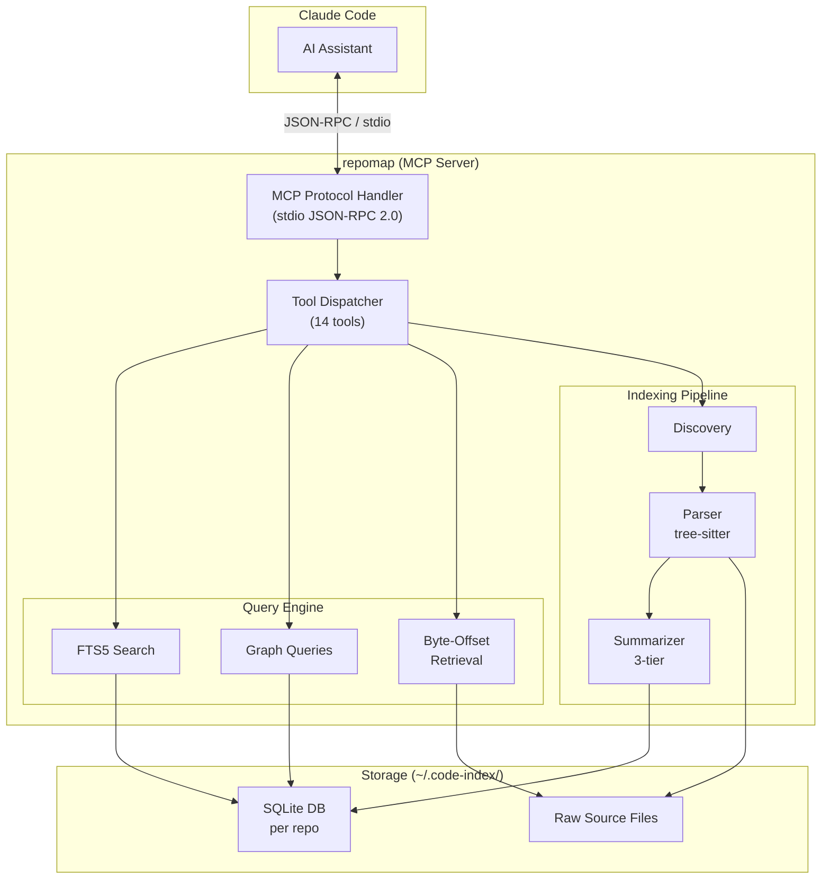

---

## Indexing Pipeline

When a repository is indexed, files flow through four stages: discovery,
parsing, summarization, and storage.

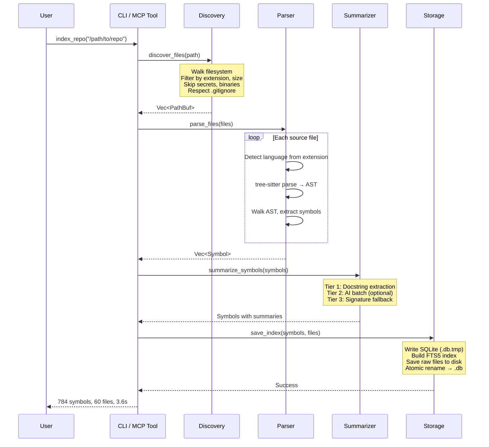

### Incremental Re-indexing

After the initial index, only changed files are re-processed:

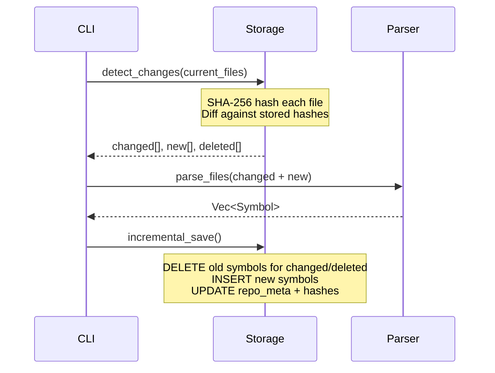

---

## Storage Layout

All indexes are stored under `~/.code-index/` (override with `CODE_INDEX_PATH`).

```
~/.code-index/
├── owner-reponame.db          # SQLite database (symbols, metadata, FTS5)
├── owner-reponame/             # Raw source files (for byte-offset retrieval)
│   ├── src/main.rs
│   ├── src/lib.rs
│   └── ...
├── local-anotherrepo.db        # Repos without git remotes use "local" owner
└── local-anotherrepo/
```

When a repo has a git remote, owner and repo name are extracted from the URL
(`git@github.com:owner/repo.git` → `owner/repo`).  Without a remote, it falls
back to `local/<dirname>`.

### SQLite Schema

Each `.db` file contains six tables:

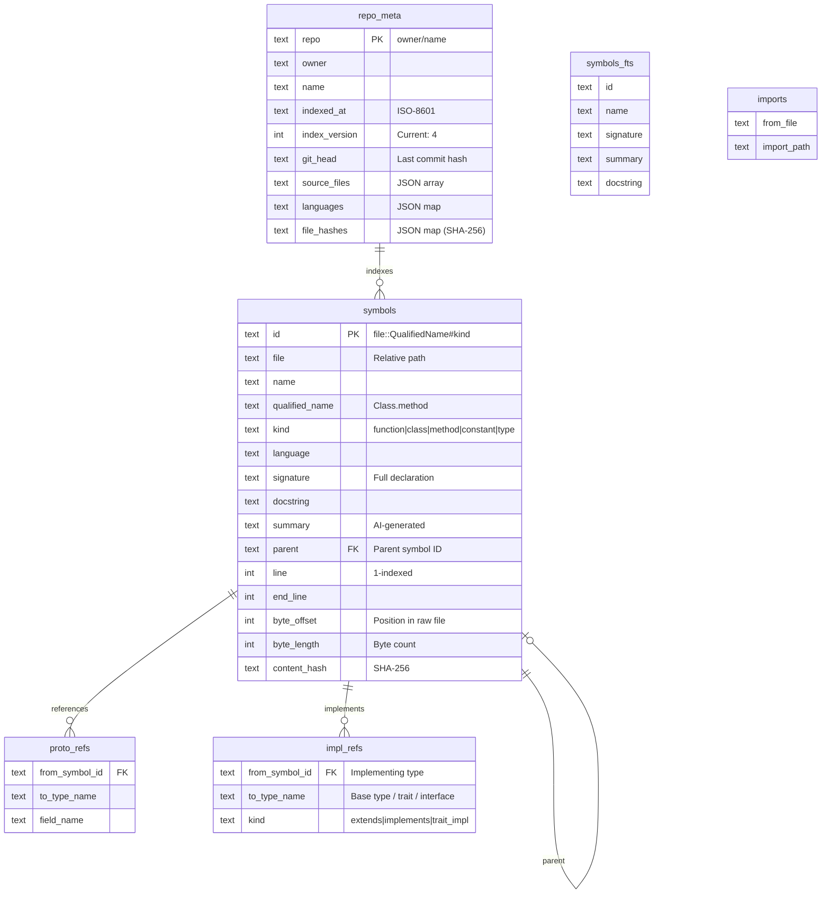

**Symbol IDs** follow the format `file_path::QualifiedName#kind`.  For example:
- `src/main.rs::main#function`
- `src/parser/extractor.rs::walk_tree#function`
- `models.py::User.save#method`

Overloaded symbols get a `~N` suffix: `handler.go::validate~1#function`.

---

## Symbol Retrieval (O(1))

The key performance feature: retrieving a symbol's full source code requires
no re-parsing.  The index stores the byte offset and length into the raw file.

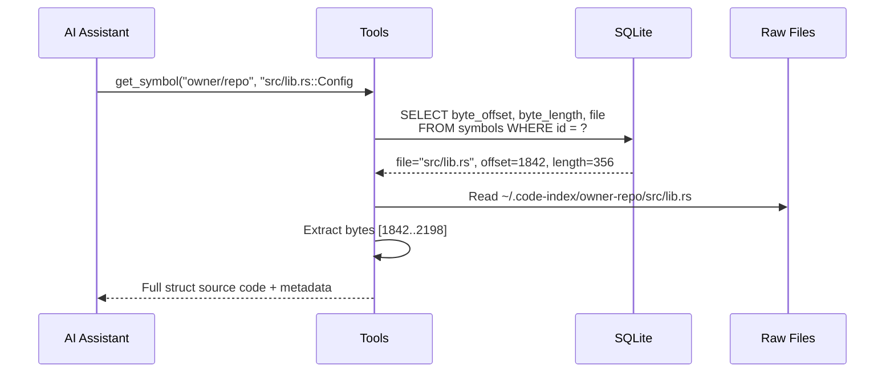

---

## Knowledge Graph

repomap builds a lightweight knowledge graph from four relationship types
stored directly in SQLite (no external graph database required).

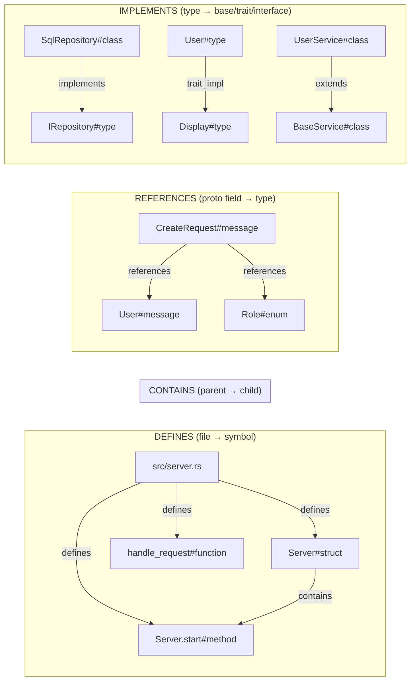

### DEFINES

Every symbol has a `file` column linking it to its source file.  This
relationship answers "what symbols does this file define?"

```
Query: SELECT * FROM symbols WHERE file = 'src/parser/extractor.rs'
→ All functions, structs, types defined in that file
```

### CONTAINS

Symbols with a `parent` column form a hierarchy.  Methods belong to classes,
nested types belong to modules.

```
Query: SELECT * FROM symbols WHERE parent = 'src/models.py::User#class'
→ All methods and attributes of the User class
```

### REFERENCES

The `proto_refs` table tracks protobuf field-level type references.  When a
message has a field of type `User`, that creates a reference edge.

```
Query: find_dependents("myproto.proto::User#message")
→ All messages with fields that reference the User type
```

### IMPLEMENTS

The `impl_refs` table tracks explicit implementation and inheritance
relationships.  This works with languages that use explicit syntax:

| Language | Syntax | Edge kind |
|---|---|---|
| Rust | `impl Trait for Type` | `trait_impl` |
| Java | `class Foo extends Bar implements Baz` | `extends` / `implements` |
| C# | `class Foo : IBar, Baz` | `implements` / `extends` |
| TypeScript | `class Foo extends Bar implements IBaz` | `extends` / `implements` |
| Python | `class Foo(Bar, Baz):` | `extends` |
| PHP | `class Foo implements Bar { use Baz; }` | `implements` / `trait_impl` |
| Dart | `class Foo extends Bar implements Baz` | `extends` / `implements` |
| JavaScript | `class Foo extends Bar` | `extends` |

Languages with implicit interface satisfaction (like Go's structural typing)
are not supported by `find_implementations` — use `find_dependents` for
proto-level cross-references instead.

```
Query: find_implementations("src/models.rs::Authenticatable#type")
→ All types that implement the Authenticatable trait
```

### Graph Query Examples

The `graph_query` tool accepts relationship-type queries:

| Query | What it returns |
|---|---|
| `DEFINES src/main.rs` | All symbols defined in main.rs |
| `CONTAINS src/lib.rs::Server#struct` | All children (methods) of Server |
| `REFERENCES User` | All symbols referencing the User type |
| `IMPLEMENTS Authenticatable` | All types implementing Authenticatable |

Unrecognized queries return an error suggesting the appropriate structured tool.

All queries support an optional `format: "mermaid"` parameter that returns a
renderable Mermaid diagram instead of raw rows — useful for visualizing
inheritance trees, class structure, or file contents.

### Why the Graph Matters

To see the practical difference, consider a real question an AI assistant
might need to answer: **"What types implement or extend something in this
codebase?"**

**With the graph — 1 tool call, 0.3ms:**

```
graph_query("IMPLEMENTS")
→ 14 precise edges, structured data:

  rust/sample.rs::User          --[trait_impl]--> Authenticatable
  rust/sample.rs::User          --[trait_impl]--> std::fmt::Display
  csharp/sample.cs::SqlRepository --[implements]--> IRepository
  java/Sample.java::Sample      --[extends]----> BaseService
  java/Sample.java::Sample      --[implements]--> Serializable
  java/Sample.java::Sample      --[implements]--> Repository
  typescript/sample.ts::UserService --[extends]--> BaseService
  typescript/sample.ts::UserService --[implements]--> Searchable
  python/sample.py::UserService --[extends]----> BaseService
  php/sample.php::UserService   --[implements]--> Authenticatable
  php/sample.php::UserService   --[trait_impl]--> Timestampable
  dart/sample.dart::UserService --[extends]----> BaseService
  javascript/sample.js::UserService --[extends]--> BaseService
  ...
```

Every relationship, every language, with the edge kind — in one call.

**Without the graph — text search, multiple calls, incomplete:**

An AI assistant without graph edges would need to:

1. `search_symbols("extends implements")` — returns 11 results, but 9 are
   false positives (functions in the extraction code whose *names* contain
   "extends" or "implements").  Only 2 actual classes found.
2. `search_symbols("impl")` — returns 0 results (Rust's `impl` isn't a
   symbol name, it's syntax).
3. For each candidate, call `get_symbol()` to read the source and manually
   parse the signature — another 2–11 tool calls.
4. Still misses: Rust trait impls (`impl Display for User`), Python
   inheritance (`class Foo(Bar):`), PHP `implements`/`use`, C# `: IRepository`,
   Dart `extends` — because none of these put "extends" or "implements" in
   the symbol's searchable text.

**Result:** 2 of 14 relationships found, mixed with 9 false positives, after
3–13 tool calls.

**Impact on AI assistant efficiency:**

| Metric | With graph | Without graph |
|---|---|---|
| Tool calls | 1 | 3–13 |
| Wall time | < 1ms | 5–50ms |
| Tokens consumed | ~200 (structured JSON) | ~3,000–8,000 (reading source, filtering noise) |
| Accuracy | 14/14 relationships | 2/14 found, 9 false positives |

The token savings matter most.  Each unnecessary `get_symbol` call returns
50–200 lines of source code that the assistant must read, understand, and
discard.  In a real codebase with hundreds of classes, the without-graph
approach could easily consume **10,000–30,000 tokens** just to answer one
inheritance question — tokens that count against the context window and slow
down reasoning.  The graph answers the same question in ~200 tokens of
structured data, leaving the context window free for actual work.

This compounds across a session.  An assistant refactoring a class hierarchy
might ask this question 5–10 times as it traces relationships.  The graph
saves **50,000–200,000 tokens per session** on inheritance queries alone,
which is the difference between fitting the task in one conversation and
running out of context halfway through.

---

## Search Architecture

### FTS5 Full-Text Search

Symbol search uses SQLite's FTS5 extension with BM25 ranking, plus a custom
scoring layer tuned for code navigation:

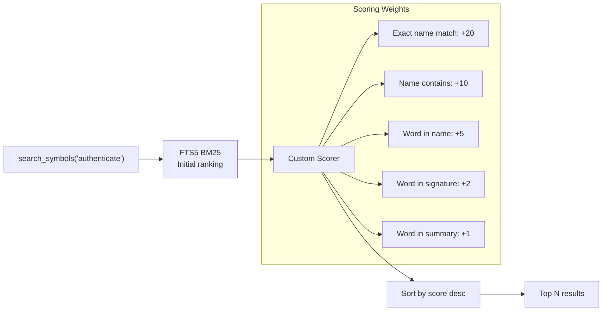

### Text Search

`search_text` searches raw file contents line-by-line — useful for strings,
comments, config values, and anything that isn't a symbol name.

---

## Parser Architecture

repomap uses [tree-sitter](https://tree-sitter.github.io/tree-sitter/) for
all language parsing.  Each language has a `LanguageSpec` that maps AST node
types to symbol extraction rules.

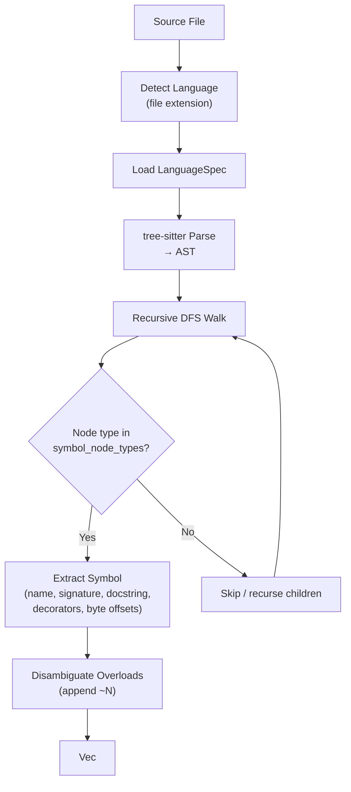

### Supported Languages (13)

| Language | Symbol Types Extracted |
|---|---|
| Python | functions, classes, methods, constants |
| TypeScript | functions, classes, methods, interfaces, type aliases, enums |
| JavaScript | functions, classes, methods, arrow functions, generators |
| Go | functions, methods, type declarations |
| Rust | functions, structs, enums, traits, impl blocks, type aliases |
| Java | methods, constructors, classes, interfaces, enums |
| PHP | functions, classes, methods, interfaces, traits, enums |
| Dart | functions, classes, mixins, enums, extensions, methods, type aliases |
| C# | classes, records, interfaces, enums, structs, delegates, methods, constructors |
| C | functions, structs, enums, unions, typedefs |
| Lua | functions |
| Protobuf | messages, enums, services, RPCs |
| SQL | CREATE TABLE, CREATE VIEW, CREATE INDEX |

---

## Summarization Pipeline

Summaries are generated in three tiers, from cheapest to most expensive:

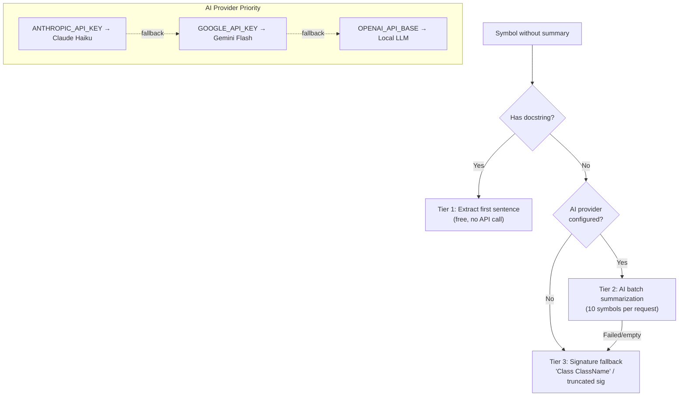

---

## File Discovery

Discovery walks the filesystem with multiple filter layers to find indexable
source files while excluding noise and secrets.

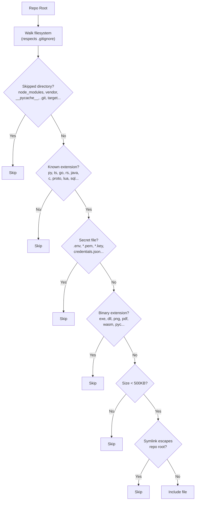

---

## MCP Protocol

repomap communicates over stdin/stdout using JSON-RPC 2.0, the transport
defined by the Model Context Protocol.

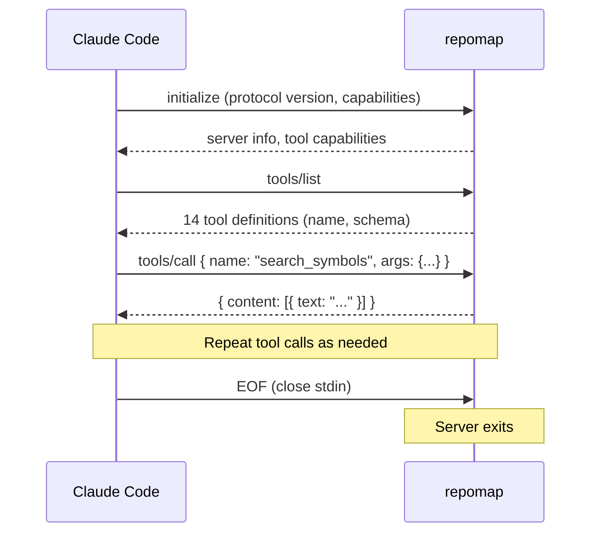

---

## Project Layout

```
repomap/
├── Cargo.toml                  # Rust project config + dependencies
├── Cargo.lock
├── README.md
├── docs/
│   └── ARCHITECTURE.md         # This file
├── rust/
│   └── src/
│       ├── main.rs             # Entry point: CLI + MCP server
│       ├── mcp.rs              # JSON-RPC protocol handler
│       ├── tools.rs            # 14 MCP tool implementations
│       ├── storage.rs          # SQLite index store
│       ├── graph.rs            # Knowledge graph queries
│       ├── discovery.rs        # File discovery + filtering
│       ├── summarizer.rs       # 3-tier AI summarization
│       ├── config.rs           # Environment-based configuration
│       ├── hooks.rs            # Git hook installation/removal
│       ├── stats.rs            # Usage statistics + token savings tracking
│       └── parser/
│           ├── mod.rs           # Parse orchestrator
│           ├── extractor.rs     # AST walker + symbol extraction
│           ├── symbols.rs       # Symbol data structure
│           ├── languages.rs     # Per-language extraction rules (13 langs)
│           ├── imports.rs       # Import path extraction
│           ├── impl_refs.rs     # Implementation/inheritance extraction
│           └── proto_refs.rs    # Protobuf field references
└── tests/
    └── fixtures/               # Sample files for each language
```
