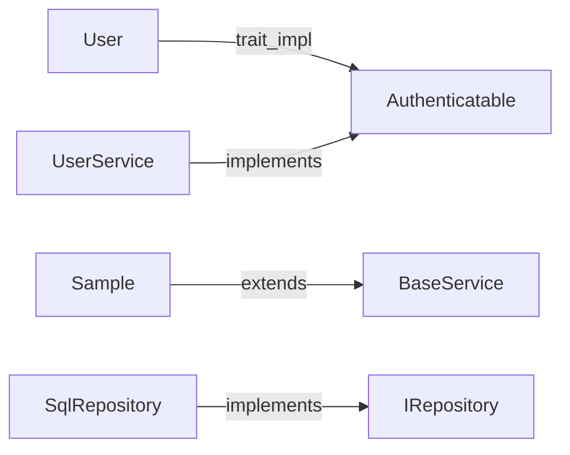

# Tool Reference

repomap exposes 14 MCP tools that AI assistants use to navigate indexed
codebases.  This document covers every tool's parameters, return format, and
typical usage.

---

## Workflow: With vs Without repomap

| Task | Without repomap | With repomap |
|---|---|---|
| "What does `authenticate` do?" | Load the entire file (~600 lines, ~2400 tokens) | `search_symbols` → `get_symbol` (~30 lines, ~120 tokens) |
| "Show me all methods on `Server`" | Load file, scroll to struct, read manually | `get_file_outline` → hierarchical list with signatures |
| "Find every function named `validate`" | `ripgrep` across repo, parse results | `search_symbols(query="validate", kind="function")` |
| "What proto messages reference `User`?" | Grep `.proto` files, follow field types manually | `find_dependents("User#message")` → instant |
| "How is the `parser/` directory structured?" | `ls -R`, read files one by one | `get_file_tree(path_prefix="parser/")` → nested tree with symbol counts |

The difference compounds.  A typical investigation that requires 5-6 file
loads without repomap (burning 10K+ tokens of context) can be done with 3
targeted tool calls (~500 tokens).

---

## Common Workflows

### Orienting in an unfamiliar repo

```
1. index_repo(path="/path/to/repo")     → index the codebase
2. get_repo_outline(repo="owner/repo")  → languages, directories, symbol counts
3. get_file_tree(repo, path_prefix="src/") → see the structure
4. get_file_outline(repo, file_path="src/main.rs") → see what's in a file
```

### Finding and reading a specific function

```
1. search_symbols(repo, query="handleRequest", kind="function")
   → returns matches ranked by relevance
2. get_symbol(repo, symbol_id="src/server.rs::handle_request#function")
   → full source code
```

### Understanding a type's usage

```
1. search_symbols(repo, query="Config", kind="type")
   → find the type definition
2. find_dependents(repo, symbol_id="src/config.rs::Config#struct")
   → everything that references it
3. get_symbols(repo, symbol_ids=["id1", "id2", "id3"])
   → batch-fetch the relevant source
```

---

## Tool Reference

### index_repo

Index a local git repository.  Reads files from disk, parses symbols, and
stores the index.  Derives the repository identifier from the git remote URL.

| Parameter | Type | Required | Default | Description |
|---|---|---|---|---|
| `path` | string | yes | — | Absolute path to the repository |
| `use_ai` | boolean | no | true | Generate AI symbol summaries (slower but richer search) |

**Returns:**
```json
{
  "success": true,
  "repo": "owner/reponame",
  "file_count": 60,
  "symbol_count": 784,
  "languages": { "rust": 23, "python": 7 },
  "_meta": { "timing_ms": 3655.97 }
}
```

**Notes:**
- If the repo has a git remote, owner/repo is extracted from the URL.
  Without a remote, falls back to `local/<dirname>`.
- With `use_ai: true`, requires `ANTHROPIC_API_KEY`, `GOOGLE_API_KEY`, or
  `OPENAI_API_BASE` to be set.

---

### index_folder

Index a local directory.  Same as `index_repo` but skips AI summaries and
does not attempt git remote resolution.

| Parameter | Type | Required | Default | Description |
|---|---|---|---|---|
| `path` | string | yes | — | Absolute path to the directory |

**Returns:**
```json
{
  "success": true,
  "repo": "local/dirname",
  "file_count": 78,
  "symbol_count": 697,
  "_meta": { "timing_ms": 3265.42 }
}
```

---

### list_repos

List all indexed repositories.

No parameters.

**Returns:**
```json
{
  "count": 3,
  "repos": [
    {
      "repo": "owner/reponame",
      "indexed_at": "2026-03-11T19:00:00Z",
      "symbol_count": 784,
      "file_count": 60,
      "languages": { "rust": 23 },
      "index_version": 3
    }
  ],
  "_meta": { "timing_ms": 2.1 }
}
```

---

### get_repo_outline

High-level overview of an indexed repository: directories, languages, and
symbol kinds.

| Parameter | Type | Required | Description |
|---|---|---|---|
| `repo` | string | yes | Repository identifier (`owner/repo` or just `repo`) |

**Returns:**
```json
{
  "repo": "owner/reponame",
  "indexed_at": "2026-03-11T19:00:00Z",
  "file_count": 60,
  "symbol_count": 784,
  "languages": { "rust": 23, "lua": 30, "python": 7 },
  "directories": { "src/": 23, "tests/": 7, "scripts/": 3 },
  "symbol_kinds": { "function": 340, "struct": 45, "method": 120 },
  "_meta": { "timing_ms": 5.3 }
}
```

---

### get_file_tree

Nested file tree for the repository, optionally filtered by path prefix.

| Parameter | Type | Required | Default | Description |
|---|---|---|---|---|
| `repo` | string | yes | — | Repository identifier |
| `path_prefix` | string | no | `""` | Filter to files under this path |

**Returns:**
```json
{
  "repo": "owner/reponame",
  "path_prefix": "src/parser/",
  "tree": [
    {
      "path": "src/parser/",
      "type": "dir",
      "children": [
        { "path": "src/parser/extractor.rs", "type": "file", "language": "rust", "symbol_count": 42 },
        { "path": "src/parser/languages.rs", "type": "file", "language": "rust", "symbol_count": 13 }
      ]
    }
  ],
  "_meta": { "timing_ms": 3.1, "file_count": 8 }
}
```

---

### get_file_outline

All symbols in a file, hierarchically structured with signatures and
summaries.  Methods appear as children of their parent class/struct.

| Parameter | Type | Required | Description |
|---|---|---|---|
| `repo` | string | yes | Repository identifier |
| `file_path` | string | yes | Path to file within the repo |

**Returns:**
```json
{
  "repo": "owner/reponame",
  "file": "src/server.rs",
  "language": "rust",
  "symbols": [
    {
      "id": "src/server.rs::Server#struct",
      "kind": "struct",
      "name": "Server",
      "signature": "pub struct Server",
      "summary": "Main server state",
      "line": 10,
      "children": [
        {
          "id": "src/server.rs::Server.start#method",
          "kind": "method",
          "name": "start",
          "signature": "pub async fn start(&self, port: u16) -> Result<()>",
          "summary": "Start listening on the given port",
          "line": 25,
          "children": []
        }
      ]
    }
  ],
  "_meta": { "timing_ms": 1.8, "symbol_count": 12 }
}
```

---

### get_symbol

Full source code of a specific symbol.  Retrieval is O(1) via stored byte
offsets — no re-parsing required.

| Parameter | Type | Required | Description |
|---|---|---|---|
| `repo` | string | yes | Repository identifier |
| `symbol_id` | string | yes | Symbol ID (from `get_file_outline` or `search_symbols`) |

**Returns:**
```json
{
  "id": "src/server.rs::Server.start#method",
  "kind": "method",
  "name": "start",
  "file": "src/server.rs",
  "line": 25,
  "end_line": 40,
  "signature": "pub async fn start(&self, port: u16) -> Result<()>",
  "decorators": [],
  "docstring": "Start listening on the given port.",
  "content_hash": "a1b2c3...",
  "source": "pub async fn start(&self, port: u16) -> Result<()> {\n    ...\n}",
  "_meta": { "timing_ms": 0.8 }
}
```

**Symbol ID format:** `file_path::QualifiedName#kind`
- `src/main.rs::main#function`
- `src/models.py::User.save#method`
- Overloads get a `~N` suffix: `handler.go::validate~1#function`

---

### get_symbols

Batch retrieval of multiple symbols in one call.

| Parameter | Type | Required | Description |
|---|---|---|---|
| `repo` | string | yes | Repository identifier |
| `symbol_ids` | array of strings | yes | List of symbol IDs |

**Returns:**
```json
{
  "symbols": [
    { "id": "...", "name": "...", "source": "...", ... },
    { "id": "...", "name": "...", "source": "...", ... }
  ],
  "errors": [
    { "id": "bad_id", "error": "Symbol not found: bad_id" }
  ],
  "_meta": { "timing_ms": 2.1, "symbol_count": 2 }
}
```

---

### search_symbols

Full-text search across symbol names, signatures, summaries, and docstrings.
Results are ranked by a custom scoring function tuned for code navigation.

| Parameter | Type | Required | Default | Description |
|---|---|---|---|---|
| `repo` | string | yes | — | Repository identifier |
| `query` | string | yes | — | Search query |
| `kind` | string | no | — | Filter by symbol kind (`function`, `class`, `method`, `constant`, `type`) |
| `language` | string | no | — | Filter by language |
| `max_results` | integer | no | 10 | Maximum results (clamped to 1–100) |

**Scoring weights:**

| Match type | Points |
|---|---|
| Query matches symbol name exactly | +20 |
| Query is substring of name | +10 |
| Each query word found in name | +5 |
| Query is substring of signature | +8 |
| Each query word in signature | +2 |
| Query is substring of summary | +5 |
| Each query word in summary | +1 |
| Each query word in docstring | +1 |

**Returns:**
```json
{
  "repo": "owner/reponame",
  "query": "authenticate",
  "result_count": 3,
  "results": [
    {
      "id": "src/auth.rs::authenticate#function",
      "kind": "function",
      "name": "authenticate",
      "file": "src/auth.rs",
      "line": 42,
      "signature": "pub fn authenticate(token: &str) -> Result<Claims>",
      "summary": "Validate and decode a JWT token",
      "score": 30
    }
  ],
  "_meta": { "timing_ms": 4.2 }
}
```

---

### search_text

Raw text search across file contents.  Use this for strings, comments,
config values, and anything that isn't a symbol name.

| Parameter | Type | Required | Default | Description |
|---|---|---|---|---|
| `repo` | string | yes | — | Repository identifier |
| `query` | string | yes | — | Text to search for (case-insensitive) |
| `file_pattern` | string | no | — | Filter files by glob pattern |
| `max_results` | integer | no | 20 | Maximum results |

**Returns:**
```json
{
  "repo": "owner/reponame",
  "query": "TODO",
  "result_count": 5,
  "results": [
    { "file": "src/main.rs", "line": 42, "text": "// TODO: optimize this loop" },
    { "file": "src/parser.rs", "line": 108, "text": "// TODO: handle edge case" }
  ],
  "_meta": { "timing_ms": 12.3, "files_searched": 60, "truncated": false }
}
```

**Notes:**
- Search is case-insensitive.
- Lines longer than 200 characters are truncated.
- `truncated: true` in `_meta` means results were capped at `max_results`.

---

### find_dependents

Find all symbols that reference a given symbol.  For protobuf types, returns
messages with fields of that type.

| Parameter | Type | Required | Description |
|---|---|---|---|
| `repo` | string | yes | Repository identifier |
| `symbol_id` | string | yes | Symbol ID to find dependents of |

**Returns:**
```json
{
  "repo": "owner/reponame",
  "symbol_id": "proto/types.proto::User#message",
  "results": [
    { "id": "proto/api.proto::CreateRequest#message", "name": "CreateRequest", "kind": "message", "language": "protobuf" }
  ],
  "_meta": { "timing_ms": 1.5, "result_count": 1 }
}
```

---

### find_implementations

Find types that implement a trait, interface, or base class.  Works with
languages that use explicit implementation syntax (Rust `impl Trait for Type`,
Java/C#/TypeScript `extends`/`implements`, Python class inheritance, PHP
`implements`/`use`, Dart `extends`/`implements`, JavaScript `extends`).
Languages with implicit interface satisfaction (like Go) are not supported.

| Parameter | Type | Required | Description |
|---|---|---|---|
| `repo` | string | yes | Repository identifier |
| `symbol_id` | string | yes | Symbol ID of the trait/interface/base class |

**Returns:**
```json
{
  "repo": "owner/reponame",
  "symbol_id": "src/models.rs::Authenticatable#type",
  "results": [
    {
      "id": "src/models.rs::User#type",
      "relationship": "trait_impl",
      "name": "User",
      "kind": "type",
      "language": "rust",
      "file": "src/models.rs"
    }
  ]
}
```

---

### graph_query

Query the knowledge graph directly.  Supports four relationship types.

| Parameter | Type | Required | Default | Description |
|---|---|---|---|---|
| `repo` | string | yes | — | Repository identifier |
| `cypher` | string | yes | — | Query mentioning `DEFINES`, `CONTAINS`, `REFERENCES`, or `IMPLEMENTS` |
| `format` | string | no | `"json"` | Output format: `"json"` for structured rows, `"mermaid"` for a diagram |

**Relationship queries:**

| Query | Returns |
|---|---|
| `DEFINES src/main.rs` | All symbols defined in that file |
| `CONTAINS src/lib.rs::Server#struct` | All children (methods, fields) of Server |
| `REFERENCES User` | All symbols with fields referencing the User type |
| `IMPLEMENTS Authenticatable` | All types implementing Authenticatable |

**Returns (JSON format, default):**
```json
{
  "repo": "owner/reponame",
  "cypher": "DEFINES src/main.rs",
  "rows": [
    ["main", "function", "rust"],
    ["Config", "struct", "rust"]
  ],
  "row_count": 2,
  "_meta": { "timing_ms": 1.2 }
}
```

**Returns (Mermaid format):**
```json
{
  "repo": "owner/reponame",
  "cypher": "IMPLEMENTS",
  "format": "mermaid",
  "mermaid": "graph LR\n    User[\"User\"] -->|trait_impl| Authenticatable[\"Authenticatable\"]\n    ...",
  "row_count": 13,
  "_meta": { "timing_ms": 0.3 }
}
```

Paste the `mermaid` value into any Markdown viewer to render the diagram:



**Notes:**
- Only the four structured relationship types are supported. Unrecognized
  queries return an error suggesting the appropriate tool.
- Mermaid output works with all four relationship types. Most useful with
  `IMPLEMENTS` (inheritance trees) and `CONTAINS` (class structure).

---

### invalidate_cache

Delete the index for a repository, forcing a full re-index on the next
`index_repo` or `index_folder` call.

| Parameter | Type | Required | Description |
|---|---|---|---|
| `repo` | string | yes | Repository identifier |

**Returns:**
```json
{
  "success": true,
  "repo": "owner/reponame",
  "message": "Index and cached files deleted for owner/reponame"
}
```

---

## CLI Reference

When invoked without arguments, repomap starts as an MCP server on
stdin/stdout.  Subcommands are available for direct indexing from the terminal.

### `repomap index <PATH> [OPTIONS]`

Index a local directory from the command line.

| Flag | Description |
|---|---|
| `--incremental` | Only re-index files that changed (SHA-256 diff) |
| `--no-ai` | Skip AI-generated symbol summaries |

```bash
# Full index, no AI
repomap index /path/to/repo --no-ai

# Incremental update after git pull
repomap index /path/to/repo --incremental --no-ai
```

### `repomap index-repo <PATH> [OPTIONS]`

Index a local git repository, deriving the repo identifier from the git
remote.

| Flag | Description |
|---|---|
| `--no-ai` | Skip AI summaries |

### `repomap` (no arguments)

Start the MCP server on stdin/stdout.  This is how Claude Code connects.
